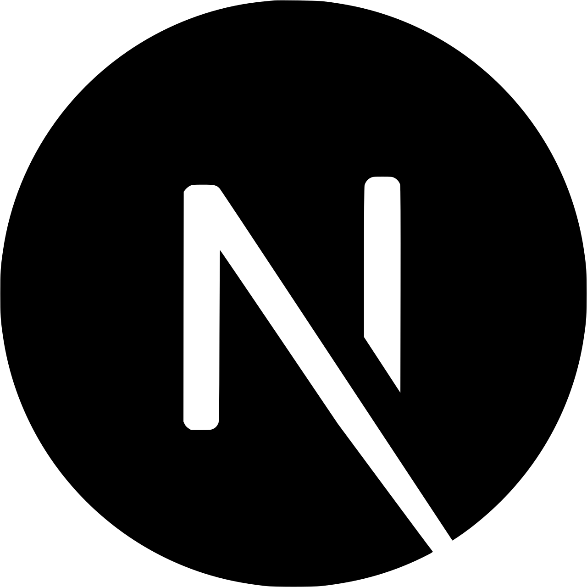

##  Hello there, I'm Valeriy Dichanskiy

### I'm fullstack developer
- 🔨 I'm working on the [Dev-blog]
- 🎓 I'm currently learning: [TypeScript]
- 📜 I'd like to learn in future: GraphQL, Socket.IO, webRTC
- 📈 My 2021 Goals: to commit more on Github
- 🔮 Hate summer, love pasta
 

### Languages and Tools I use:
 

 
 

---

[DuckoMan]: https://github.com/DuckoMan
[Dev-blog]: https://github.com/DuckoMan/Keyboard-blog
[TypeScript]: https://www.typescriptlang.org/docs/
