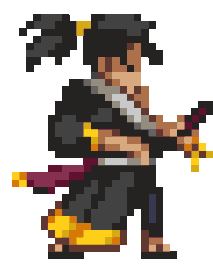

## 👋 Hello there, I'm Valerii Dychanskyi

### I'm Software Engineer

-   🔨 My corrent pet project is [notexp]
-   📈 My 2023 Goals: to contribute more to open source
-   🔮 Hate summer, love pasta  

    
    

<!--  -->
<!--  -->

[duckoman]: https://github.com/DuckoMan
[notexp]: https://github.com/dchnsk/notexp
[DotNet]: https://dotnet.microsoft.com/en-us/download
[rust]: https://www.rust-lang.org/
[graphql]: https://graphql.org/
[socket.io]: https://socket.io/
[webrtc]: https://webrtc.org/
