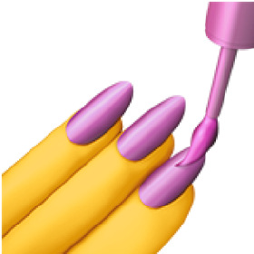

##  Hello there, I'm Valerii Dychanskyi

### I'm fullstack developer

-   🔨 I'm working on the [Financier] (private repo)
-   🎓 I'm currently learning: [NestJS]
-   📜 I'd like to learn in future: [Rust], [GraphQL], [Socket.IO], [webRTC]
-   📈 My 2022 Goals: to contribute more to open source
-   🔮 Hate summer, love pasta  

### Languages and Tools I use:

 
 

[duckoman]: https://github.com/DuckoMan
[financier]: https://github.com/DuckoMan/Financier
[nestjs]: https://docs.nestjs.com/
[rust]: https://www.rust-lang.org/
[graphql]: https://graphql.org/
[socket.io]: https://socket.io/
[webrtc]: https://webrtc.org/
